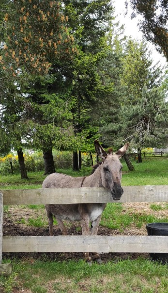

### Le Bleymard - Pont de Monvert / 12 juin
Aujourd'hui on bascule dans les Cévennes. Les cours d'eau partent désormais vers la Méditerranée. On commence par une montée sur plusieurs kilomètres pour atteindre le mont Finiels (1699 m) en passant par la station de ski du Mont Lozère. A quelques jours près on aurait vu 2000 moutons qui arrivent dimanche prochain aux estives. Juste après le pique nique orage et grêle au rdv... Bon on a de la chance cela n'a pas duré longtemps. Arrivée à Pont de Monvert au bord du Tarn... Et de nouveau la pluie revient.
 

---

### Cheylard l'Évêque / Le Bleymard - 11 juin
Belle étape entre ces 2 villages, sous le soleil. On passe par Mirandol, où Stevenson séjourna et rencontra des techniciens venus en repérage pour la future ligne de chemin de fer qui sera construite plus de 20 ans après (en 1901). Arrêt aux sources du Lot dans la forêt du Goulet. Petit filet d'eau très froid (idéal pour refroidir le rosé...). Arrivée sur le Bleymard, village typique avec ses toits en lauze.
 
[Au démarrage](images/e7-img1.jpg) 
[Mirandol tunnel anti congère](images/e7-img2.jpg) 
[Mirandol viaduc chemin de fer](images/e7-img3.jpg) 
[Sources du Lot](images/e7-img5.jpg) 
[Ça fait du bien](images/e7-img6.jpg) 
[On ferait presque la sieste](images/e7-img7.jpg) 
[Les Alpiers](images/e7-img8.jpg) 
[Vue sur le Bleymard](images/e7-img10) 
[Bleymard 1](images/e7-img12.jpg) 
[Bleymard 2](images/e7-img13.jpg) 
[Bleymard 3](images/e7-img14.jpg) 
[Bleymard 4](images/e7-img15.jpg)

---

 
Wapa, l'ânesse de 2 randonneuses faisant la même étape que nous.

### La Bastide Puy Laurent / Chasseradés - 10 juin
Petite étape ce matin, plutôt ensoleillée. Un parc d'éoliennes fait partie du chemin. Stevenson serait surpris... Du coup pour se remettre des émotions de la veille restaurant réservé ce midi.
 
[Au départ de La Bastide](images/e6-img1.jpg) 
[Tiens une éolienne](images/e6-img5.jpg) 
[Et une autre](images/e6-img4.jpg) 
[Une énigme](images/e6-img2.jpg) 
[Chasseradés](images/e6-img12.jpg) 
[Chasseradés : lavoir et abreuvoir](images/e6-img11.jpg) 
[Chasseradés : tunnel ligne chemin de fer](images/e6-img10.jpg) 

Et pendant ce temps là nos accompagnatrices visitent : 
[En chemin...](images/e6-img6.jpg) 
[La Guarde Guérin](images/e6-img7.jpg) 
[La Garde Guérin suite](images/e6-img8.jpg) 
[La Garde Guérin fin](images/e6-img13.jpg)

---

 

### Cheylard l'Évêque / La Bastide Puy Laurent - 9 juin
Il fallait que cela arrive, la pluie était au rendez-vous de cette étape. En plus notre plus longue étape (26 kms)! Cela change les paysages. Du coup pique nique rapide à Laveyrune (sous un porche de la mairie). L'etape se termine par un passage à l'abbaye de Notre Dame des Neiges occupée depuis 2022 par 8 soeurs. 

 
[On bâche](images/e5-img3.jpg) 
[Dans la brume le Château de Luc](images/e5-img4.jpg) 
[Lac de l'Auradou](images/e5-img5.jpg) 
[Forêt de la bête du Gévaudan](images/e5-img6.jpg) 
[A notre dame des neiges](images/e5-img2.jpg) 
[Et une autre à l'abbaye](images/e5-img8.jpg)

---

### Pradelles / Cheylard l'Évêque - 8 juin
Rando historique avec passage à Langogne, là où les Rumeau ont vécu de nombreuses années (les derniers ont rejoint Bordeaux en 1962). Étape en Lozère dans le pays du Gévaudan. Paysage typique de la Margeride, alternance de plateaux, pâturages, lande, bruyères et de zones boisées. Arrivée au Cheylard petit village encaissé et dominé par une chapelle accessible par un chemin de croix. 
 
[Arrivée sur Langogne](images/e4-img1.jpg) 
[En forêt](images/e4-img6.jpg) 
[A Langogne](images/e4-img2.jpg) 
[Langogne le chantier](images/e4-chantier-langogne.jpg) 
[Langogne : 59 rue Haute](images/langogne-rue-haute.jpg) 
[Un intrus](images/e4-img3.jpg) 
[Repos](images/e4-img4.jpg) 
[Cheylard l'Évêque](images/e4-img5.jpg) 
[Bien mérité](images/e4-img7.jpg) 
L'histoire : Papa est arrivé en 1930 à Langogne. Il a dirigé le chantier Beaumartin et on a habité dans une maison qui était sur le chantier et ensuite au 50 rue Haute. On est parti sur Bordeaux en 1962.

---

### Le Bouchet St-Nicolas / Pradelles - 7 juin
Dernière étape en Haute-Loire. Moins de dénivelé que les autres jours, ça repose... du coup on a pris notre temps ! Toujours dans le Velay, on est passé que dans un seul village : Landos. A l'arrivée sur Pradelles, vue sur Langogne et le lac de Naussac. Demain étape historique avec l'entrée en Lozère. 

[Landos](images/e3-img5.jpg) 
[En plein air](images/e3-img4.jpg) 
[Les foins](images/e3-img3.jpg) 
[A Pradelles](images/e3-img2.jpg) 

Et pendant ce temps-là nos accompagnatrices ... 
[Cascade de la Beaume](images/e3-img6.jpg) 
[Au lac du Bouchet](images/e3-img7.jpg) 
[Des fleurs](images/e3-img8.jpg) 
[D'autres fleurs](images/e3-img9.jpg)

---

### Le Monastier - Le Bouchet St Nicolas - 6 juin
Étape plus importante aujourd'hui avec 700 m de dénivelé positif. Un peu plus de 6h de marche ... sans compter les arrêts. Toujours des paysages Velay, pâturages... on retraverse la Loire. 
[Modestine et Patrick](images/e2-img2.jpg) 
[Champ de lentilles du Puy](images/e2-img3.jpg) 
[A Goudet](images/e2-img4.jpg) 
[Château de Beaufort](images/e2-img5.jpg) 

---
 
### Le Puy - Le Monastier - 5 juin
Première étape de la rando. Le beau temps est au rdv. Bonne mise en jambe de près de 20kms. De jolis sentiers avec alternance de montées/descentes. Paysage typique de la Haute-Loire. 
[La Loire](images/e1-img3.jpg) 
[Ça monte](images/e1-img2.jpg) 
[Un calvaire](images/e1-img1.jpg) 
[Reprise après repas](images/e1-img4.jpg) 

---

### J-1 au Puy la veille du départ
Ça y est le groupe est réuni au Puy en Velay. Repos avant le démarrage demain matin 5/06. Parmi les randonneurs il y a 2 ponots. Après le resto, obligation de goûter la fameuse verveine du Puy... 
[Le Puy trompe l'oeil](images/le-puy.jpg)

---

### Samedi 27 mai.
WE chez Annick et Jeannot. On répète le parcours, surtout qu'ils y ont été récemment. Mais eux pas de chance début mai, froid et pluie au rdv...

---